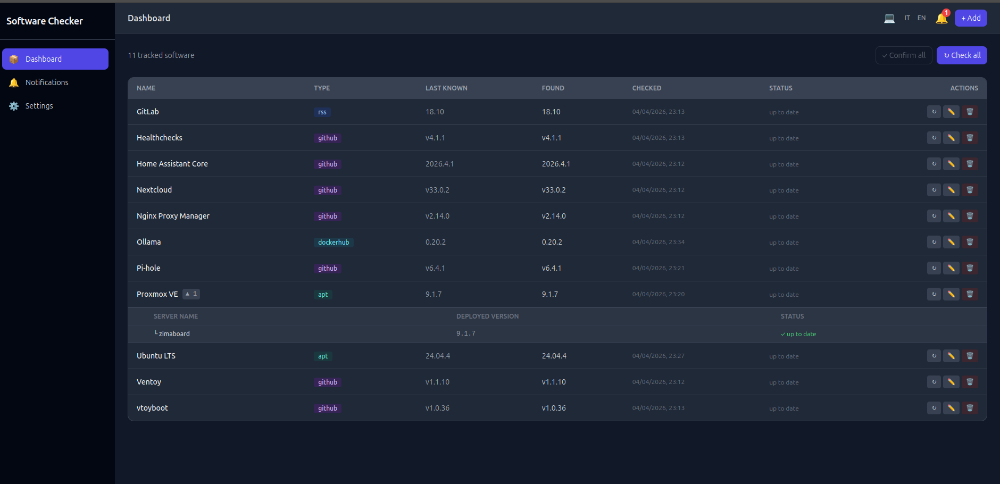

# Software Checker

Track software releases and get notified when new versions are available.




## Features

- **Multi-source tracking** — GitHub releases, RSS/Atom feeds, HTML scraping, Debian APT packages, Docker Hub images
- **Smart notifications** — notified only when a version actually changes; first discovery is silent
- **Acknowledge flow** — confirm single or all updates; notification badge disappears, history stays
- **Manual version control** — edit the known version directly to re-trigger alerts (useful for testing)
- **Notification channels** — in-app (real-time via SSE), Telegram Bot, Web Push (browser); configurable per software (default: in-app only)
- **Scheduled checks** — per-software interval: hourly, daily, or weekly
- **On-demand checks** — force a check for one or all software from the dashboard
- **Error tracking** — if a check fails the dashboard shows a ⚠️ badge with the error message on hover
- **Multi-server instances** — attach N server instances to each software entry, each with its own deployed version; the dashboard shows which servers are up to date and which are outdated
- **Dark mode** — follows system preference by default; override to light or dark via the toolbar toggle (💻 / ☀️ / 🌙)
- **Multilingual UI** — Italian and English; switch with the IT / EN toggle in the toolbar; preference saved in browser

## Architecture

```
Browser
  └── nginx :80
        ├── /          → Vue 3 SPA (Tailwind CSS)
        └── /api/*     → Express backend :3000
                            ├── PostgreSQL (pg)
                            ├── node-cron scheduler
                            ├── GitHub API / Cheerio / rss-parser / axios
                            └── Notifiers: SSE · Telegram · Web Push
```

## Quick Start

### Prerequisites

- Docker + Docker Compose v2
- Git

### Run

```bash
git clone https://github.com/manzolo/software-checker.git
cd software-checker

cp .env.example .env
# Edit .env — at minimum set DB_PASSWORD

./manager.sh up
```

Open **http://localhost** in your browser.

### manager.sh

```bash
./manager.sh up                   # Build and start all containers
./manager.sh down                 # Stop and remove containers
./manager.sh restart [service]    # Recreate one or all containers
./manager.sh build [service]      # Rebuild images
./manager.sh logs [service]       # Follow logs (all or one service)
./manager.sh shell <service>      # Open a shell inside a container
./manager.sh status               # Show container status
```

Services: `backend`, `frontend`, `db`

## Configuration

Copy `.env.example` to `.env` and configure:

| Variable | Required | Description |
|---|---|---|
| `DB_PASSWORD` | ✅ | PostgreSQL password |
| `GITHUB_TOKEN` | optional | Raises GitHub API rate limit from 60 to 5000 req/hour |
| `TELEGRAM_BOT_TOKEN` | optional | Telegram bot token (from @BotFather) |
| `TELEGRAM_CHAT_ID` | optional | Telegram chat or group ID |
| `VAPID_PUBLIC_KEY` | optional | Auto-generated on first run if empty |
| `VAPID_PRIVATE_KEY` | optional | Auto-generated on first run if empty |
| `VAPID_SUBJECT` | optional | mailto address for Web Push |

Telegram and Web Push can also be configured from the **Settings** page in the UI.

## Adding Software

| Type | URL example | Extra field |
|---|---|---|
| `github` | `https://github.com/nodejs/node` | — |
| `rss` | `https://github.com/nodejs/node/releases.atom` | — |
| `scrape` | any webpage | CSS selector pointing to the version text |
| `apt` | URL of a Debian `Packages` file or `changelogs.ubuntu.com/meta-release-lts` | Package name (e.g. `pve-manager`); ignored for Ubuntu meta-release |
| `dockerhub` | `https://hub.docker.com/r/ollama/ollama` | — |

### APT examples

```
# Proxmox VE package version (pve-manager) from trixie repo
URL:     http://download.proxmox.com/debian/pve/dists/trixie/pve-no-subscription/binary-amd64/Packages
Package: pve-manager

# Latest Ubuntu LTS (e.g. 24.04.4)
URL:     https://changelogs.ubuntu.com/meta-release-lts
Package: ubuntu-lts   (any value — the field is ignored for meta-release files)
```

### Docker Hub

Provide the image URL (`https://hub.docker.com/r/namespace/image` or official images like `https://hub.docker.com/r/library/nginx`). The checker fetches the 100 most recently updated tags, skips `latest` / variant tags (`-rocm`, `-arm64`, …) and pre-releases (`-rc`, `-beta`, …), and returns the highest stable semver tag.

## Notification Logic

```
Check runs
  ├── version == last_version  →  nothing (already acknowledged)
  ├── last_version == null     →  silent first discovery (badge only)
  ├── check fails              →  ⚠️ error badge on dashboard (error message on hover)
  └── version != last_version  →  notify via per-software channels
                                   dashboard badge lights up

User clicks Acknowledge
  └── last_version = latest_found  →  badge off, history kept
```

### Per-software notification channels

Each software entry has its own set of enabled channels (configured in the edit form):

| Channel | Default | Requires global setting |
|---|---|---|
| In-app (SSE) | ✅ enabled | — |
| Telegram | ❌ disabled | Telegram token + chat ID in Settings |
| Web Push | ❌ disabled | Browser subscription in Settings |

A channel must be enabled **both** on the software and in global Settings to trigger.

## Multi-server Instances

A software entry can have N **instances**, each representing a server where that software is deployed:

- Add instances from the **Edit** form (name + deployed version)
- The dashboard shows a `▼ N` badge next to the software name; click to expand
- Each instance shows its deployed version and status relative to the latest upstream:
  - ✓ up to date — deployed version matches latest found
  - ⚠ outdated — deployed version is behind
- Use the **↑ vX.Y.Z** shortcut button to copy the upstream version into an instance's deployed version field

## Setting Up Telegram

1. Create a bot via [@BotFather](https://t.me/BotFather) and copy the token
2. Get your Chat ID (send a message to your bot, then visit `https://api.telegram.org/bot<TOKEN>/getUpdates`)
3. Enter both in **Settings → Telegram** and click **Test Telegram**

## Setting Up Web Push

1. Open **Settings → Web Push**
2. Click **Subscribe to browser notifications** — your browser will ask for permission
3. Enable the toggle and save
4. Click **Test Web Push** to verify

VAPID keys are auto-generated on first run and stored in the database.

## UI Features

### Dark mode

The toolbar shows a theme toggle (💻 / ☀️ / 🌙) that cycles between:
- **System** (default) — follows OS/browser preference, updates automatically
- **Light** — always light
- **Dark** — always dark

The preference is saved in `localStorage`.

### Language

Click **IT** or **EN** in the toolbar to switch between Italian and English. The preference is saved in `localStorage`.

## Docker Images

Pre-built images are available on Docker Hub:

```yaml
services:
  backend:
    image: manzolo/software-checker-backend:latest
  frontend:
    image: manzolo/software-checker-frontend:latest
  db:
    image: postgres:16-alpine
```

## Development

```bash
# Backend (hot reload)
cd backend && npm install && node --watch src/index.js

# Frontend (Vite dev server with proxy)
cd frontend && npm install && npm run dev
```

The Vite dev server proxies `/api` to `http://localhost:3000`.

## API Reference

### Software

| Method | Path | Description |
|---|---|---|
| GET | `/api/software` | List all tracked software (includes instances) |
| POST | `/api/software` | Add software |
| PUT | `/api/software/:id` | Update (including `last_version`) |
| DELETE | `/api/software/:id` | Remove |
| POST | `/api/software/:id/check` | Force check now |
| POST | `/api/software/:id/acknowledge` | Confirm version |
| POST | `/api/software/check-all` | Force check all |
| POST | `/api/software/acknowledge-all` | Confirm all |

### Instances

| Method | Path | Description |
|---|---|---|
| GET | `/api/software/:id/instances` | List instances for a software |
| POST | `/api/software/:id/instances` | Add an instance |
| PUT | `/api/software/:id/instances/:iid` | Update an instance |
| DELETE | `/api/software/:id/instances/:iid` | Remove an instance |

### Notifications & Settings

| Method | Path | Description |
|---|---|---|
| GET | `/api/notifications/stream` | SSE stream |
| GET | `/api/notifications` | List notifications |
| PUT | `/api/notifications/read-all` | Mark all read |
| GET | `/api/settings` | Get settings |
| PUT | `/api/settings` | Update settings |
| POST | `/api/settings/test-telegram` | Send test message |
| POST | `/api/settings/test-webpush` | Send test push |
| GET | `/api/push/vapid-public-key` | VAPID public key |
| POST | `/api/push/subscribe` | Register push subscription |

## License

MIT
